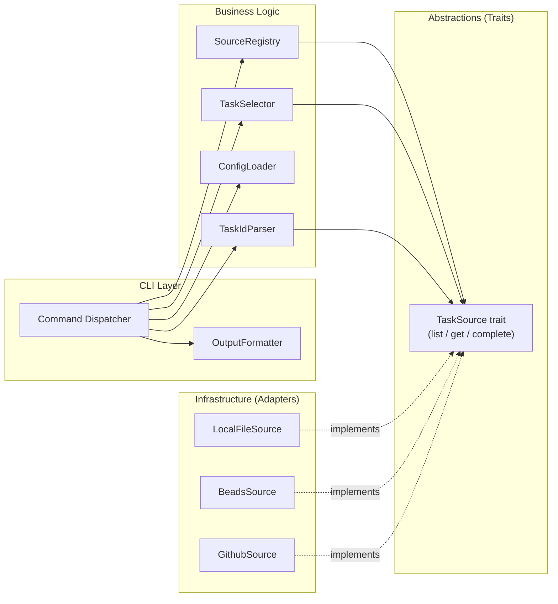

# Architecture

This document defines the clean architecture boundaries for task-marshal: what constitutes business logic, what is abstracted behind traits, and what is infrastructure.

---

## Principle

**Business logic must never depend on infrastructure.**

Source adapters, CLI parsing, and I/O are infrastructure concerns. The selection algorithm, configuration loading, ID routing, and output formatting are business logic. Business logic depends only on traits (abstractions); infrastructure implements those traits.

---

## Business Logic

### Task Selection

- **Knows:** priority ordering, dependency-blocked filtering, role filtering, sort key construction
- **Operations:** Given a merged list of `TaskSummary` from all sources and a `SelectionFilter`, returns the single best candidate or `None`
- **Business rules:**
  - A task is eligible only if its state is `unstarted` or `in_progress`
  - A task is ineligible if any of its dependencies is not `done`
  - Role filter: unassigned tasks pass any role filter
  - Sort order: Priority (asc) → source order index (asc) → NativeId (asc, lexicographic)
  - Selection is deterministic: identical inputs always produce identical output

### Task ID Routing

- **Knows:** `<SourceKey>:<NativeId>` format, the set of valid SourceKeys
- **Operations:** Parse a `TaskId` string; encode a `(SourceKey, NativeId)` pair into a `TaskId` string
- **Business rules:** Invalid format or unknown SourceKey → `InvalidTaskId` error

### Configuration Loading

- **Knows:** Config file name, walk-up discovery algorithm, TOML schema
- **Operations:** Discover the config file path; parse into `Config`
- **Business rules:** No config file found → `ConfigError`; invalid TOML or schema violation → `ConfigError`

### Source Registry

- **Knows:** Which source keys have concrete implementations; the ordered source list from config
- **Operations:** Build ordered `Vec<Box<dyn TaskSource>>` from `Config`; look up a single source by `SourceKey`

---

## Abstractions (Traits)

### `TaskSource`

The single abstraction that all source adapters implement. Business logic depends exclusively on this trait.

**Operations:**

- `list(filter: &SelectionFilter) -> Result<Vec<TaskSummary>, SourceError>`
  Returns all eligible (unblocked, matching filter) tasks from this source.
  Must not modify the source.
- `get(native_id: &NativeId) -> Result<Task, SourceError>`
  Returns the full task content for a given native ID.
  Must not modify the source.
- `complete(native_id: &NativeId, comment: Option<&str>) -> Result<(), SourceError>`
  Marks the task as done and propagates to the source. Atomic.

**Error contract:**

- `SourceError::Unavailable` — source is unreachable; caller should skip and warn
- `SourceError::NotFound` — task with given native_id does not exist in this source
- `SourceError::Io(...)` — underlying I/O failure
- `SourceError::Parse(...)` — source output could not be parsed

---

## Infrastructure

### `LocalFileSource`

- **External system:** The local filesystem, reading/writing a markdown file
- **Integration:** Direct file I/O (`std::fs`)
- **Key complexity:** Markdown task block parser; in-place atomic update (temp file + rename)
- **Dependency boundary:** Reads and interprets the markdown file format; no subprocess calls

### `BeadsSource`

- **External system:** The `bd` CLI binary
- **Integration:** Subprocess calls (`std::process::Command`)
- **Key complexity:** Spawning `bd` with optional `BEADS_DIR` override; parsing BEADS JSON output; mapping BEADS fields to domain types
- **Dependency boundary:** `bd` binary must be in `PATH`; does not access `.beads/` directly

### `GithubSource`

- **External system:** The `gh` CLI binary, which communicates with the GitHub API
- **Integration:** Subprocess calls (`std::process::Command`)
- **Key complexity:** Constructing correct `gh` command arguments; parsing `gh` JSON output; handling `gh issue close` + optional `gh issue comment`
- **Dependency boundary:** `gh` binary must be in `PATH` and authenticated; does not call GitHub API directly

---

## CLI Layer

The CLI layer is infrastructure, not business logic.

### Command Dispatcher

- Parses arguments using `clap`
- Orchestrates the sequence: load config → build sources → invoke business logic → format output
- Maps error types to exit codes

### OutputFormatter

- Renders `Task` → `TaskBlock` plain-text string
- Renders `Vec<TaskSummary>` → table string
- No logic — pure rendering

---

## Dependency Rules

| Layer | May depend on |
|---|---|
| Business Logic | Abstractions (traits), domain types |
| Abstractions | Domain types only |
| Infrastructure | Abstractions (to implement them), domain types, external system SDKs/subprocess |
| CLI Layer | Business Logic, Abstractions, domain types, Infrastructure (to construct concrete types) |

**Forbidden:**

- Business logic importing any infrastructure type directly
- Infrastructure types depending on each other
- `TaskSelector` calling any source directly (must receive pre-fetched summaries)

**Intentional exception — `ConfigError` in infrastructure:**

`LocalFileSource::new()` and `SourceRegistry::from_config()` return `ConfigError` (a
business-logic type) rather than a separate infrastructure error. This is a deliberate
pragmatic tradeoff: path-validation failures during source construction are logically
configuration errors, and introducing a separate `InfrastructureSetupError` type would add
indirection with no benefit at v1 scope. If infrastructure grows significantly, extracting a
shared `ValidationError` type is the recommended refactoring path.

---

## Cross-Cutting Concerns

### Error Handling

All fallible operations return `Result<T, E>`. Error types are distinct per layer:

- `ConfigError` — config loading failures
- `SourceError` — source adapter failures (per-operation)
- `SelectionError` — selection logic failures (currently only `NoTaskFound`)
- `CompletionError` — done propagation failures
- `CliError` — argument parsing or dispatch failures

See [constraints.md](constraints.md) for implementation rules.

### Output Channels

- **stdout:** Task content only (`TaskBlock`, `TaskSummary` table, completion confirmation)
- **stderr:** Warnings (skipped unavailable sources), errors, diagnostic messages

### Subprocess Safety

All external commands (`bd`, `gh`) are invoked with arguments passed as separate process arguments, never via shell interpolation. This prevents command injection.

See [security.md](security.md).
