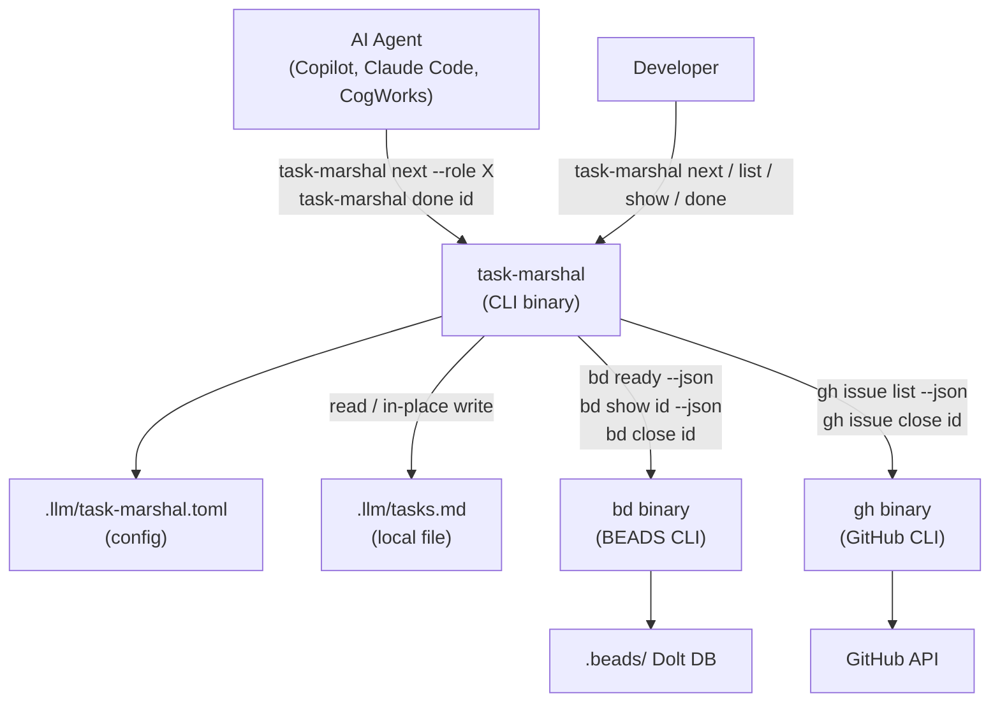
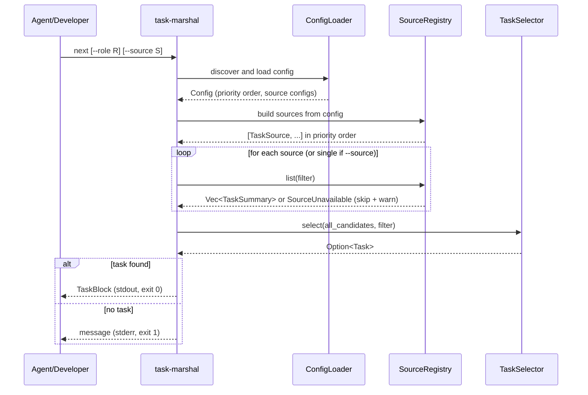
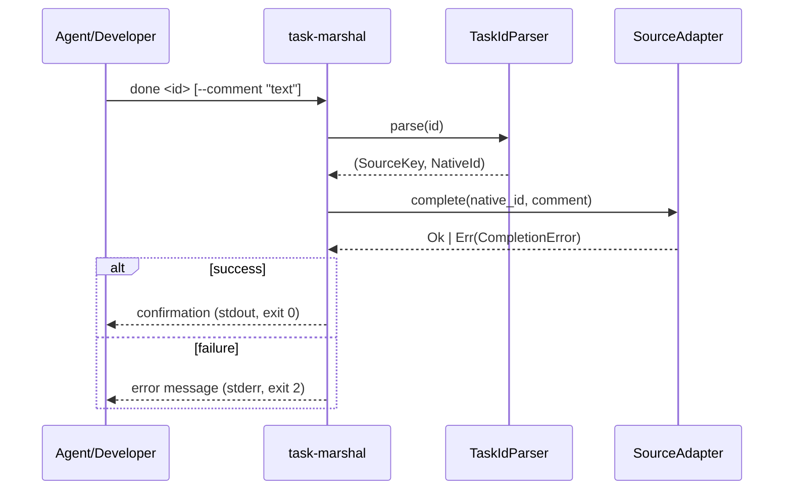

# System Overview

---

## Purpose

`task-marshal` is a CLI broker that provides a single, stable interface for retrieving and completing tasks, regardless of where those tasks originate. It translates between three heterogeneous task systems and the two consumer types that use them.

**Core value proposition:** Agents call `next` and `done`. They never inspect task source files.

---

## System Context

---

## Data Flow: `task-marshal next`

---

## Data Flow: `task-marshal done`

---

## System Boundaries

| Boundary | Inside task-marshal | Outside task-marshal |
|---|---|---|
| Task selection logic | Selection algorithm, priority ordering, dependency filtering | Task content and state storage |
| Task completion | Routing to correct source adapter | Persisting completion in the source |
| Configuration | Discovery, parsing, validation | Authoring tasks, managing credentials |
| Output | Formatting task blocks for stdout | Rendering or processing the output |

---

## Source Summary

| Source Key | Backend | Integration Method | Dependency Filtering |
|---|---|---|---|
| `local` | `.llm/tasks.md` (markdown) | Direct file read/write | task-marshal parses deps inline |
| `beads` | `.beads/` Dolt DB | `bd` CLI subprocess | `bd ready` handles this natively |
| `github` | GitHub Issues API | `gh` CLI subprocess | Not supported in v1 (all issues treated as unblocked) |

---

## Glossary Summary

See [vocabulary.md](vocabulary.md) for full definitions.

| Term | One-line definition |
|---|---|
| `Task` | A unit of work with an ID, title, description, acceptance criteria, state, priority, optional role and dependencies |
| `TaskId` | `<source>:<native_id>` — self-routing, opaque to consumer |
| `NativeId` | The identifier used by the source system (e.g., `TASK-042`, `bd-a1b2`, `187`) |
| `SourceKey` | The source prefix in a TaskId (`local`, `beads`, `gh`) |
| `TaskBlock` | Full task content returned by `next` or `show` |
| `TaskSummary` | Abbreviated task info used by `list` |
| `TaskState` | `unstarted`, `in_progress`, `blocked`, or `done` |
| `Priority` | Integer — lower number = higher priority (P0 most urgent) |
| `Role` | Agent role label for task assignment (e.g., `coder`, `tester`, `architect`) |
| `SelectionFilter` | Optional role and/or source restriction for `next` and `list` |
| `Config` | Parsed TOML configuration loaded from `.llm/task-marshal.toml` |
